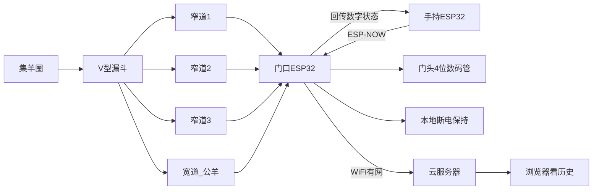

# 自动数羊：漏斗四通道 + 门头屏 + 无线手持 + 云存档

## 已对齐的目标

- **干什么**：每天放牧对账——出门几只、回来几只；通道里通过的羊要记下来。屏幕主数字是**本次出门或本次回圈**，不是圈内存栏。
- **规模**：约 800 只；母羔不同过；体型不齐；有几只宽公羊。
- **过门**：现有集羊圈保留，原门改成漏斗 + **4 道单列**（3 窄 1 宽），目标 8–15 分钟过完。
- **现场**：羊棚有 220V、门头已有 WiFi、夜间也要数。
- **人机**：赶羊看手持 OLED；门头用最简单的 **4 位数码管**（站在门口约 2–3 米内能看清）；门口不装按键盒；网页是锦上添花。
- **数据**：门口断网也能数；有网再同步云；人不在场不是刚需。
- **不做**：摄像头、手机原生 App、圈内存栏主数字、门口有线按键盒。
- **交付**：电子全套（BOM / 固件 / 网页）+ 通道关键尺寸和材料清单；通道由你找焊工按图做。
- **钱**：电子 ≤ 4000 元；通道改造另算。

## 总体结构

计数真相在门口盒子里：四道之和 = 当前会话数。手持只发命令、镜像显示；云只是副本。ESP-NOW 点对点，不经过家里路由，路由挂了仍能遥控。

## 1. 通道（你找人做，计划出尺寸）

在现有集羊圈出口把单门换成漏斗口，后面并排 4 道，总宽大约 1.7–1.9 m（含隔板），单道长度 **2.0–2.5 m**（保证传感区里基本只有一只羊躯干）。

- 窄道 ×3：内净宽 **36–38 cm**
- 宽道 ×1：内净宽 **42–45 cm**，放在靠边、用颜色/开口略区分，方便赶公羊
- 侧板封实（羊看不见旁边就不容易回头、抬腿）；高度约 **90–100 cm**
- 漏斗夹角不要太陡，从集羊圈口收到 4 道，避免在洞口对撞
- 每道传感区：沿通道两束对射，间距 **40–50 cm**，高度对准**躯干中线**（约 55–65 cm，现场用一只中等羊标定）。光束打腿会把四条腿数成多只

第一版不做单向矛门（你说过通道里不回头）。若以后出现门口探头又退，再加。

材料清单会按：方管骨架、封板、地脚、传感器安装孔（M18）给出，不指定你必须用钢还是木，焊工可按现有围栏对接。

## 2. 怎么数（光电，不要视觉）

每道 **一对 E3F 类对射（TX+RX）× 2 组**，共 8 对。12V NPN 常开，经光耦进 ESP32。

判定一只羊：同一道上 **A 先挡、B 后挡**，且两束有重叠（躯干够长），时间窗大约 80 ms–1.5 s，然后该道闭锁 **250–400 ms** 防止蹄子二次沿。探头又退（只挡 A）不计。

方向不靠传感器：手持上选 **出门 / 回圈**，再按 **开始** 才自动加。四道独立计数后加总。一道坏了，另外三道仍可用（门口调试页能看出哪道停了）。

允许错 1–2 只：手持 **+1 / -1** 改当前会话。清零用长按，避免和结束抢键。

## 3. 门头数码管 + 无线手持（唯一遥控）

赶羊时看手持；门头数码管给站在门口的人扫一眼。门口**不装按键盒**。不用户外大字模组、油价牌、P10 点阵。

### 门头

最简单的 **4 位红色共阴数码管 + TM1637 驱动板**（时钟模块那种，两根线 CLK/DIO 接 ESP32）。显示当前会话 0–9999。旁路两颗 LED：出门 / 回圈；再加一颗「进行中」。

- 常见 0.56 寸：约 1.5–2 米内清楚，物料几块钱
- 若门口要稍远一点，仍用数码管，只换成 **1.2 寸 4 位**（还是 TM1637 或 74HC595，不是另一种显示技术）
- 院子对面看不清是正常的——那个距离看手持

盒子做防水遮檐即可，数码管本身不按户外 IP65 大屏来做。门口箱内不必再留调试 OLED（数码管 + 局域网页够用，少一块屏）。

### 手持硬件

单独一块 **ESP32-C3/S3**，不接家里 WiFi（省电、也不抢门口那块的射频）。

- 屏：0.96–1.3 寸 OLED。第一行 出门/回圈 + 待开始/进行中/已结束；中间大字当前数；底行电池和信号
- 键（分两侧，开始和结束不要挨着）：出门、回圈、开始、结束、+1、-1
- 供电：18650 或聚合物电池 + USB-C 充电，一次放牧（约 1 小时按键）绰绰有余；闲置休眠，按任意键唤醒
- 外壳：可单手握、挂绳孔；按键凹进去或加护圈，免得揣兜误触
- 预估手持物料 **80–150 元**，仍在 4000 内

### 按键语义（切模式和开始分开，减少误触）

- **出门 / 回圈**：只切换「正在看哪一头」的数字。进行中按这两键**无效**，必须先结束
- **开始**：当前这头进入进行中，光电才 +1；门头和手持同步跳数。若已经结束过、晚到几只，再按开始 = **同一会话继续累加**（不自动清零）
- **结束**：光电停止自动加，数字冻结，立刻排队同步云。此时仍可用 +1/-1 改冻结值（再同步）。赶完主群就按结束，不用盯着尾巴
- **+1 / -1**：进行中或已结束都能改当前这头；待开始且数字为 0 时 -1 忽略（不出现负数）
- **长按结束约 2 秒**：清零当前这头（出门或回圈），要屏上闪「清零?」再松手生效。不清另一头、不改已归档的历史日

手持没电或掉线：光电若已在进行中会继续数，门头仍跳；充好电连上后屏幕对齐门口真相。开始/结束/+1/-1 做不成——后门是门口箱的**局域网调试页**（紧急开始/结束），不当日常用。

### 无线

**ESP-NOW** 点对点（门口 MAC 写进手持，或首次开机近场配对）。加密用预共享密钥。门口约 10 Hz 广播「模式、状态、出门数、回圈数」；手持按键立即发命令、门口应答。圈里有钢栏和羊群，按 **50–80 m** 设计；PCB 天线不够就门口外置小胶棒天线。不走 WiFi，手机热点、路由重启都不影响遥控。

## 3b. 会话与云上的数

- 自然日（NTP）归档后，新的一天两头都从 0 开始
- 数码管 / 手持永远只显示「当前选中的那一头」
- 云上同时留当日出门、回圈、未归（出门 − 回圈）
- 结束才会把「这一头告一段落」写进云；开始后的过程数也可以节流上报（例如每 5 秒或每 +10），方便人在家扫一眼，但以结束值为准

## 4. 电子架构（4000 元内）

两台 MCU，不要每道一块板：

- **门口 ESP32-S3**：8 路光电、TM1637 数码管、WiFi 上云、ESP-NOW 从机
- **手持 ESP32-C3/S3**：OLED、六键、电池、ESP-NOW 主机发令

完整型号、数量、搜索词、约价见 [sheep-counter/docs/bom.md](c:\Code\Cursor\sheep-counter\docs\bom.md)。电子合计约 **660–1100 元**。通道钢材另算。不做第二只手持（配对协议按一只写）。

断电：当前会话写入 NVS/LittleFS，来电恢复数字和模式。计数不依赖云、不依赖家里电脑。

## 5. 云和网页（简单）

你已有云服务器。做最小服务，不写手机 App。

- 设备：本地队列，有网就 `HTTPS POST` 当日出门/回圈/时间（带 token）
- 服务器：SQLite + 一页表格（日期、出门、回圈、未归）+ 当前实时数；Docker 或单文件 + systemd，不绑特定语言栈（实施时用 Python 小服务，便于改）
- 设备另开一个**局域网调试页**（断云时仍能看分道计数），不是给人日常用的

门头 WiFi 已有，ESP32 做 Station。云挂了不影响数羊和大屏。

## 6. 实施顺序（先验证再焊四道）

1. **出图**：漏斗 + 4 道尺寸、传感器开孔、门头安装、手持键位/外壳、电子 BOM。
2. **桌面一道**：一块板 + 一对双光束 + 假羊（纸箱按躯干高度推过），把误计/漏计调到可接受，再买齐 8 对。
3. **门口固件**：会话状态机、TM1637 数码管、断电恢复、四道汇总、ESP-NOW。
4. **手持固件**：六键、OLED 镜像、休眠、掉线提示；与门口对打再装现场。
5. **云**：同步与那一页历史。
6. **现场**：先装 1 道真羊试半天，标定高度和闭锁时间，再装齐 4 道。
7. **放牧日**：早出晚归对账；记下漏计场景，只改滤波参数，不改机械除非卡羊。

仓库里新建 [`sheep-counter/`](sheep-counter/)：`docs/` 尺寸与 BOM、`firmware/gate/`、`firmware/handheld/`、`cloud/`、`wiring/`。

## 明确不在第一版

- 摄像头融合、每只羊时间戳清单、圈内存栏主数字、原生 App、通道自动单向门、门口有线按键盒、第二只手持、户外大字 LED / P10 点阵。
